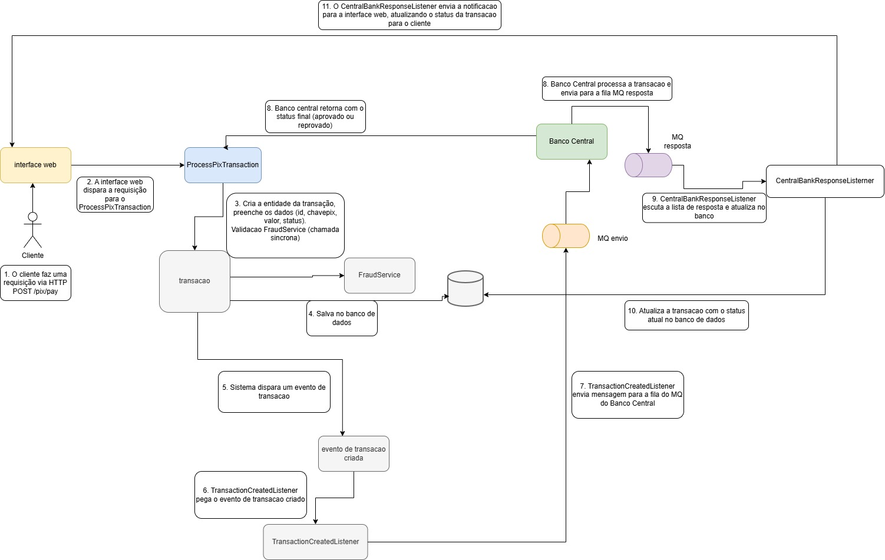

# ProcessPixTransaction

Este projeto foi criado a partir de um case técnico para a vaga de Desenvolvedor Backend. 

O objetivo do projeto é implementar uma API para processar transações Pix, utilizando as melhores práticas de desenvolvimento e arquitetura de software.

